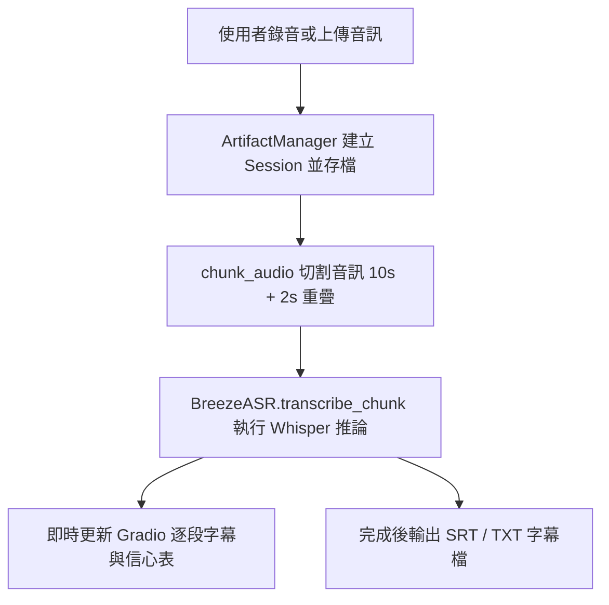

# Breeze ASR Captioner

以 MediaTek Breeze ASR Whisper 模型為核心，提供切片轉錄與字幕匯出功能的 Gradio 應用程式。

## 架構
- `ArtifactManager`：管理每次轉錄產生的音訊切片、字幕檔與暫存資料夾。
- `chunk_audio`：將音訊切成 10 秒區塊，並保留 2 秒重疊確保上下文連貫。
- `BreezeASR`：載入 `MediaTek-Research/Breeze-ASR-25`，負責 Whisper 推論與信心分數計算。
- Gradio 介面：負責上傳/錄音、顯示逐段字幕、信心表格，以及提供 SRT/TXT 檔案下載。

## Flowchart


## 依賴套件
專案使用 `pyproject.toml` 管理依賴，主要套件如下：

- `gradio`
- `torch`
- `torchaudio`
- `transformers`

## 安裝與使用
1. 建立虛擬環境並安裝套件：
   ```bash
   python -m venv .venv
   source .venv/bin/activate
   pip install -e .
   ```
2. 啟動應用程式：
   ```bash
   python app.py
   ```
3. 開啟終端中顯示的本機網址，錄音或上傳音訊，即可在介面上即時查看逐段字幕、信心指標，並於完成後下載 SRT/TXT。

### 在 Google Colab 執行
```python
!pip install -q gradio torch torchaudio transformers
%pip install -e .

import app
app.build_interface().launch(share=True)
```
> 若 `pip install -e .` 需要構建資訊，請確保 `pyproject.toml` 內已加入：
> ```toml
> [build-system]
> requires = ["setuptools>=61", "wheel"]
> build-backend = "setuptools.build_meta"
> ```

## 開發重點
- Whisper 生成長度限制會依模型 `max_target_positions` 自動調整，避免超過最大輸出長度。
- 信心值由模型輸出分數轉換而成，若遇到強制 token 會以預設確定值處理避免錯誤。
- 緩存資料可透過「清理暫存」按鈕立即移除，避免磁碟堆積。
